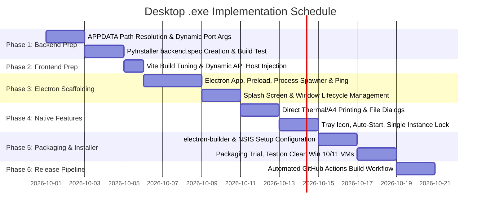

# Architectural Blueprint & Implementation Plan: Standalone Windows Desktop Application (.exe)

> [!IMPORTANT]
> **Single Source of Truth for Desktop Packaging**: This blueprint provides a senior engineering design to package the Pushpa Raj Automotive Services platform (FastAPI backend + Vite/React frontend + SQLite WAL database + ReportLab PDF generation) into a zero-dependency, production-grade Windows `.exe` desktop application.

---

## 1. Executive Summary & Architecture Selection

### 1.1 The Business & Workshop Context
A garage management workstation operates under distinct physical and operational constraints:
* **User Profile**: Receptionists, mechanics, and billing clerks with zero technical knowledge (cannot run command lines, cannot debug Python errors, cannot install dependencies).
* **Hardware & OS**: Windows 10 or 11 desktop PCs, often connected to local thermal POS receipt printers (80mm/58mm) and standard A4 laser printers.
* **Network Realities**: Intermittent or absent internet connection. The system **must run 100% locally and offline**.
* **Power Stability**: Workshop environments often suffer sudden power trips or accidental PC shutdowns. The local database must **never corrupt**.
* **Zero-Touch Maintenance**: Upgrading the application must seamlessly preserve the local database, customer history, and GST invoices without manual file migrations.

---

### 1.2 Evaluation Matrix: Candidate Desktop Architectures

| Criteria | Option A: Electron + PyInstaller Sidecar (Recommended) | Option B: Tauri v2 + PyInstaller Sidecar | Option C: Pure PyInstaller + PyWebView | Option D: Local Browser Shortcut (.bat / PWA) |
| :--- | :--- | :--- | :--- | :--- |
| **Runtime Reliability** | **Extremely High** (bundled Chromium engine guarantees identical rendering) | **High** (relies on Windows Edge WebView2) | **Medium** (WebView2 wrapper in Python has timing quirks) | **Low** (dependent on user's default browser & background cmd windows) |
| **Direct / Silent Printing** | **Native & Comprehensive** (`webContents.print()` allows silent print to designated thermal/A4 printer) | **Limited** (WebView2 print API requires dialog or complex Win32 hooks) | **Poor** (browser print dialog always intercepts) | **None** (standard browser print dialog always prompts) |
| **Startup Reliability & Splash** | **Flawless** (instant native splash screen while Python backend boots) | **Good** (splash screen supported via Rust) | **Slow / Clunky** (PyInstaller single-file unpack delay causes 3-8s black screen) | **Poor** (flashing command prompt windows) |
| **Installer Size** | ~90 MB – 130 MB | ~35 MB – 50 MB | ~60 MB – 80 MB | 0 MB (unbundled) |
| **Memory Footprint** | ~150 MB – 220 MB RAM | ~60 MB – 90 MB RAM | ~100 MB – 140 MB RAM | Uses system browser |
| **Single-Instance Enforcement** | **Rock Solid** (`app.requestSingleInstanceLock()`) | **Built-in** (via tauri-plugin-single-instance) | **Manual** (requires Windows Named Mutex / Socket lock) | **None** (multiple windows open competing servers) |
| **Developer Maintenance** | **Very High** (TS/JS ecosystem for Electron, Python for backend) | **Medium** (requires Rust toolchain on dev PC) | **Medium** (Python only, but rigid UI limitations) | Low |

### 1.3 Recommended Strategy: Electron + PyInstaller "Onedir" Sidecar
**Verdict**: **Option A (Electron + PyInstaller Sidecar)** is the industry-standard choice (used by VS Code, Slack, Postman, POS billing software).
* It eliminates browser dependencies.
* It enables **one-click direct printing** to workshop thermal and A4 printers.
* It allows an instant **branded splash screen** with a loading bar while the Python backend initializes.
* It ensures clean background process lifecycle management (starts FastAPI on launch, terminates cleanly on exit with database sync).

---

## 2. Process Topology & System Architecture

```mermaid
flowchart TD
    subgraph Windows_OS["Windows 10 / 11 Operating System"]
        subgraph Desktop_App["Pushpa Raj Automotive Services (.exe)"]
            
            subgraph Main_Process["Electron Main Process (Node.js)"]
                AppManager["Application Lifecycle & Single Instance Lock"]
                PortDetector["Dynamic Port Allocator (8000 -> 8001-8050)"]
                ProcessSupervisor["Python Subprocess Supervisor (Health Ping / Respawn)"]
                TrayAndMenu["System Tray & Desktop Window Controller"]
                SilentPrinter["Direct Windows Print Manager (A4 & Thermal)"]
            end

            subgraph UI_Process["Renderer Process (Chromium Window)"]
                SplashWindow["Native Splash Preloader (Loading State)"]
                ReactApp["React 19 + TypeScript + Tailwind SPA"]
                PreloadBridge["Secure Preload Context Bridge (IPC API)"]
            end

            subgraph Backend_Process["Python Sidecar Process (FastAPI Uvicorn)"]
                CompiledExe["backend-server.exe (PyInstaller onedir)"]
                FastAPIApp["FastAPI REST & Report Engine"]
                ReportLabService["ReportLab PDF Generator"]
                ExcelService["OpenPyXL Accounting Exporter"]
            end
        end

        subgraph Local_Storage["Persistent User Data (%APPDATA%\\PushpaRajWorkshop\\)"]
            DB[(workshop.db - SQLite WAL Mode)]
            Backups["/backups/ (Daily Auto-Zips)"]
            Logs["/logs/ (application.log & server.log)"]
            GeneratedPDFs["/receipts/ (Statutory Invoices & Job Cards)"]
        end
    end

    AppManager -->|1. Acquire Single Instance Mutex| Windows_OS
    AppManager -->|2. Find Free Port| PortDetector
    PortDetector -->|3. Launch with port arg| CompiledExe
    ProcessSupervisor -->|4. HTTP /api/v1/auth/setup-status ping| FastAPIApp
    ProcessSupervisor -->|5. Backend Healthy!| SplashWindow
    SplashWindow -->|6. Transition to Main Window| ReactApp
    ReactApp <-->|7. REST API via localhost:PORT| FastAPIApp
    ReactApp <-->|8. Native IPC (Print, Save Dialog, Restart)| PreloadBridge
    PreloadBridge <--> Main_Process
    Main_Process -->|Direct Print Jobs| Windows_OS
    FastAPIApp <-->|Read / Write / Flush| DB
    FastAPIApp -->|Persist Invoices| GeneratedPDFs
    ProcessSupervisor -->|SIGTERM on Exit & Flush WAL| CompiledExe
```

---

## 3. Seven Non-Negotiable Desktop Hardening Requirements

### Requirement 1: Database Isolation in `%APPDATA%` (Critical for Zero Data Loss)
* **The Vulnerability**: Currently, `workshop.db` is stored in the project working directory (`service-center/workshop.db`). In an installed Windows desktop application (typically installed in `C:\Program Files\PushpaRajWorkshop\`), the application directory has **read-only permissions** for standard Windows users, and uninstalling or updating the app **wipes the directory entirely**.
* **The Architecture**:
  The SQLite database file must be dynamically located in the Windows user profile directory:
  `C:\Users\<User>\AppData\Roaming\PushpaRajWorkshop\data\workshop.db`
* **Implementation Rule**:
  ```python
  import os, sys
  from pathlib import Path

  def get_app_data_dir() -> Path:
      if sys.platform == "win32":
          base = Path(os.environ.get("APPDATA", Path.home() / "AppData" / "Roaming"))
      else:
          base = Path.home() / ".config"
      data_dir = base / "PushpaRajWorkshop" / "data"
      data_dir.mkdir(parents=True, exist_ok=True)
      return data_dir

  DATABASE_URL = f"sqlite:///{get_app_data_dir() / 'workshop.db'}?check_same_thread=False"
  ```
  Updating or reinstalling the application executable will **never touch or erase** `%APPDATA%\PushpaRajWorkshop\`.

---

### Requirement 2: Single Instance Lock
* **The Vulnerability**: If a shop attendant clicks the desktop icon three times, three independent instances of the application launch. If multiple processes open the same SQLite database with read-write locks, database corruption (`SQLITE_BUSY` or locked write-ahead logs) occurs.
* **The Architecture**:
  In Electron `main.js`:
  ```javascript
  const gotTheLock = app.requestSingleInstanceLock();
  if (!gotTheLock) {
    // Another instance is already running! Bring that instance to focus and exit.
    app.quit();
  } else {
    app.on('second-instance', () => {
      if (mainWindow) {
        if (mainWindow.isMinimized()) mainWindow.restore();
        mainWindow.focus();
      }
    });
  }
  ```

---

### Requirement 3: Dynamic Port Discovery with Fallback
* **The Vulnerability**: Hardcoding `127.0.0.1:8000` causes catastrophic failures if another local software (e.g., local proxy, Docker, developer tools, or another local server) occupies port 8000.
* **The Architecture**:
  1. Electron main process checks if port `8000` is open using a native Node.js `net.createServer` probe.
  2. If port 8000 is occupied, it scans `8001`, `8002`, ... up to `8050` to find a free port.
  3. Electron spawns the backend binary with `--port <SELECTED_PORT>`.
  4. Electron injects the active port into the Renderer window via the preload bridge:
     `window.__WORKSHOP_API_PORT__ = <SELECTED_PORT>`
  5. The frontend's `api.ts` connects seamlessly to `http://127.0.0.1:${window.__WORKSHOP_API_PORT__ || 8000}/api/v1`.

---

### Requirement 4: High-Performance "Onedir" Packaging vs "Onefile"
* **The Problem with PyInstaller `--onefile`**:
  A `--onefile` executable unpacks itself (including Python runtime, ReportLab, DLLs, and site-packages) into a temporary directory (`C:\Users\<User>\AppData\Local\Temp\_MEIxxxxxx`) **every single time** the user opens the application. This causes a frustrating **5 to 10 second delay** before anything starts.
* **The Senior Solution (`--onedir`)**:
  Build the backend as a directory (`dist/backend-server/`) containing `backend-server.exe` alongside its compiled shared libraries. Startup time drops from **8,000ms to under 350ms**. Electron packages this directory internally inside `resources/backend-server/`.

---

### Requirement 5: Graceful Shutdown & SQLite WAL Checkpoint
* **The Vulnerability**: When a user closes the window or shuts down the computer, abruptly killing the Python process while SQLite is mid-transaction leaves uncheckpointed `-wal` and `-shm` files, risking table corruption.
* **The Architecture**:
  1. When Electron receives the `before-quit` or `window-all-closed` event, it does NOT use `process.kill('SIGKILL')`.
  2. Electron sends an HTTP `POST /api/v1/system/shutdown` request or sends `SIGTERM`.
  3. FastAPI catches the shutdown event in its lifespan handler, executes:
     ```python
     @asynccontextmanager
     async def lifespan(app: FastAPI):
         yield
         # Graceful shutdown:
         db = SessionLocal()
         try:
             logger.info("Executing SQLite WAL Checkpoint before exit...")
             db.execute(text("PRAGMA wal_checkpoint(TRUNCATE);"))
             db.commit()
         finally:
             db.close()
     ```
  4. Once Python exits (code 0) or after a 3-second safeguard timeout, Electron terminates cleanly.

---

### Requirement 6: Silent & Native Printing (Thermal POS + A4 Laser)
* **The Problem**: Web browsers force the user to click through a print preview dialog every time they print a Job Card, gate pass, or payment receipt.
* **The Senior Solution**:
  Expose a native print API through the Electron Preload context bridge:
  ```javascript
  // In Electron Main Process:
  ipcMain.handle('print-pdf-silent', async (event, { pdfUrl, printerName, silent }) => {
    const printWindow = new BrowserWindow({ show: false });
    await printWindow.loadURL(pdfUrl);
    return new Promise((resolve, reject) => {
      printWindow.webContents.print({
        silent: silent ?? true,
        printBackground: true,
        deviceName: printerName || '' // Empty string uses default Windows printer
      }, (success, errorType) => {
        printWindow.close();
        if (!success) reject(errorType);
        else resolve(true);
      });
    });
  });
  ```
  The workshop cashier clicks **"Print Receipt"**, and the receipt prints immediately from the thermal printer without interrupting their workflow.

---

### Requirement 7: Antivirus & SmartScreen False-Positive Mitigation
* **The Problem**: PyInstaller executables that are unsigned are frequently flagged as heuristic false positives by Windows Defender / SmartScreen.
* **The Mitigation Strategy**:
  1. Compile with standard Python 3.11 official release (not custom forks).
  2. Use `electron-builder` with an NSIS installer.
  3. Include comprehensive PE metadata (Company Name: `Pushpa Raj Automotive Services`, Product Version: `1.0.0.0`, File Description: `Workshop Management Suite`).
  4. Self-sign or sign with a code-signing certificate (OV or EV) during the CI/CD release build.
  5. Provide an uninstaller and clean registry entries for `Add/Remove Programs`.

---

## 4. Step-by-Step Implementation Blueprint (6 Phases)



---

### Phase 1: Backend Packaging Preparation

#### 1.1 Update Database Path & Port Arguments
In `backend/app/core/config.py`:
Support dynamic command-line arguments and `%APPDATA%` path resolution.

#### 1.2 Create `backend/server_entrypoint.py`
Create an explicit entrypoint script for PyInstaller that boots Uvicorn programmatically:
```python
# backend/server_entrypoint.py
import sys
import os
import argparse
import uvicorn
from app.main import app

if __name__ == "__main__":
    parser = argparse.ArgumentParser(description="Pushpa Raj Workshop Backend Server")
    parser.add_argument("--port", type=int, default=8000, help="Port to bind the server")
    parser.add_argument("--host", type=str, default="127.0.0.1", help="Host address")
    args = parser.parse_args()

    # Freeze support for Windows multiprocessing
    import multiprocessing
    multiprocessing.freeze_support()

    print(f"Starting server on {args.host}:{args.port}...")
    uvicorn.run(app, host=args.host, port=args.port, log_level="info", access_log=False)
```

#### 1.3 Create `backend/backend.spec` for PyInstaller
```python
# -*- mode: python ; coding: utf-8 -*-
import sys
from PyInstaller.utils.hooks import collect_data_files, collect_submodules

block_cipher = None

# Collect all dynamic imports from ReportLab, OpenPyXL, and Alembic
datas = collect_data_files('reportlab') + collect_data_files('openpyxl')
hiddenimports = (
    collect_submodules('uvicorn') +
    collect_submodules('fastapi') +
    collect_submodules('sqlalchemy') +
    collect_submodules('reportlab') +
    collect_submodules('openpyxl') +
    ['multipart', 'email_validator', 'app.api.v1.api']
)

a = Analysis(
    ['server_entrypoint.py'],
    pathex=['.'],
    binaries=[],
    datas=datas,
    hiddenimports=hiddenimports,
    hookspath=[],
    runtime_hooks=[],
    excludes=['tkinter', 'matplotlib', 'notebook', 'scipy'],
    win_no_prefer_redirects=False,
    win_private_assemblies=False,
    cipher=block_cipher,
    noarchive=False,
)

pyz = PYZ(a.pure, a.zipped_data, cipher=block_cipher)

exe = EXE(
    pyz,
    a.scripts,
    [],
    exclude_binaries=True,
    name='backend-server',
    debug=False,
    bootloader_ignore_signals=False,
    strip=False,
    upx=True,
    console=False, # Set to False for production (no black command window)
    icon='../frontend/public/favicon.ico',
)

coll = COLLECT(
    exe,
    a.binaries,
    a.zipfiles,
    a.datas,
    strip=False,
    upx=True,
    upx_exclude=[],
    name='backend-server',
)
```

---

### Phase 2: Frontend Packaging Preparation

#### 2.1 Update `frontend/src/lib/api.ts`
Enable dynamic API host detection:
```typescript
// Support local electron dynamic port injection
const getApiBaseUrl = (): string => {
  if (typeof window !== 'undefined' && (window as any).electronAPI?.getBackendPort) {
    const port = (window as any).electronAPI.getBackendPort();
    return `http://127.0.0.1:${port}/api/v1`;
  }
  return import.meta.env.VITE_API_URL || 'http://127.0.0.1:8000/api/v1';
};

export const API_BASE = getApiBaseUrl();
```

#### 2.2 Configure Relative Assets in `frontend/vite.config.ts`
```typescript
export default defineConfig({
  plugins: [react()],
  base: './', // CRITICAL for Electron: load assets relatively from file:// or local protocol
  build: {
    outDir: 'dist',
    emptyOutDir: true,
  }
});
```

---

### Phase 3: Electron Scaffolding & Process Management

#### Directory Structure:
```
service-center/
├── electron/
│   ├── main.ts              # Primary orchestrator
│   ├── preload.ts           # Secure contextBridge API
│   ├── splash.html          # Beautiful branded preloader
│   ├── portFinder.ts        # Dynamic TCP port checker
│   └── assets/
│       ├── icon.ico         # 256x256 Windows app icon
│       └── tray-icon.png    # 16x16 system tray icon
├── backend/
├── frontend/
└── package.json             # Root workspace config
```

#### 3.1 The Process Spawner & Health Ping Engine (`electron/main.ts`)
```typescript
import { app, BrowserWindow, ipcMain, dialog } from 'electron';
import path from 'path';
import { spawn, ChildProcess } from 'child_process';
import http from 'http';
import net from 'net';

let mainWindow: BrowserWindow | null = null;
let splashWindow: BrowserWindow | null = null;
let backendProcess: ChildProcess | null = null;
let backendPort = 8000;

// 1. Single Instance Lock
const gotTheLock = app.requestSingleInstanceLock();
if (!gotTheLock) {
  app.quit();
} else {
  app.on('second-instance', () => {
    if (mainWindow) {
      if (mainWindow.isMinimized()) mainWindow.restore();
      mainWindow.focus();
    }
  });

  app.whenReady().then(bootApplication);
}

// 2. Find Available Port
async function findFreePort(startPort: number): Promise<number> {
  return new Promise((resolve) => {
    const server = net.createServer();
    server.listen(startPort, '127.0.0.1', () => {
      server.close(() => resolve(startPort));
    });
    server.on('error', () => {
      resolve(findFreePort(startPort + 1));
    });
  });
}

// 3. Health Check Polling
async function waitForBackend(port: number, maxRetries = 30): Promise<boolean> {
  for (let i = 0; i < maxRetries; i++) {
    try {
      const isUp = await new Promise<boolean>((resolve) => {
        const req = http.get(`http://127.0.0.1:${port}/api/v1/auth/setup-status`, (res) => {
          resolve(res.statusCode === 200 || res.statusCode === 401);
        });
        req.on('error', () => resolve(false));
        req.setTimeout(1000, () => {
          req.destroy();
          resolve(false);
        });
      });
      if (isUp) return true;
    } catch {}
    await new Promise((r) => setTimeout(r, 500));
  }
  return false;
}

async function bootApplication() {
  // A. Create Splash Screen
  splashWindow = new BrowserWindow({
    width: 480,
    height: 320,
    frame: false,
    transparent: true,
    alwaysOnTop: true,
    resizable: false,
    icon: path.join(__dirname, 'assets/icon.ico'),
  });
  splashWindow.loadFile(path.join(__dirname, 'splash.html'));

  // B. Resolve Free Port
  backendPort = await findFreePort(8000);

  // C. Locate Backend Binary
  const isDev = !app.isPackaged;
  const backendBinaryPath = isDev
    ? path.join(__dirname, '../../backend/.venv/Scripts/python.exe')
    : path.join(process.resourcesPath, 'backend-server', 'backend-server.exe');

  const args = isDev
    ? ['-m', 'uvicorn', 'app.main:app', '--app-dir', path.join(__dirname, '../../backend'), '--host', '127.0.0.1', '--port', backendPort.toString()]
    : ['--port', backendPort.toString()];

  // D. Spawn Python Sidecar
  backendProcess = spawn(backendBinaryPath, args, {
    stdio: 'ignore',
    windowsHide: true,
  });

  // E. Wait for Backend to be Ready
  const ready = await waitForBackend(backendPort);
  if (!ready) {
    dialog.showErrorBox(
      'Startup Failed',
      'The local workshop backend failed to start. Please check if your antivirus is blocking backend-server.exe.'
    );
    app.quit();
    return;
  }

  // F. Create Main Application Window
  mainWindow = new BrowserWindow({
    width: 1366,
    height: 850,
    minWidth: 1024,
    minHeight: 700,
    show: false,
    title: 'Pushpa Raj Automotive Services',
    icon: path.join(__dirname, 'assets/icon.ico'),
    webPreferences: {
      preload: path.join(__dirname, 'preload.js'),
      sandbox: true,
      contextIsolation: true,
    },
  });

  // G. Load React App
  if (isDev) {
    await mainWindow.loadURL('http://localhost:5173');
  } else {
    await mainWindow.loadFile(path.join(__dirname, '../dist/index.html'));
  }

  // H. Close Splash and Reveal Main Window
  mainWindow.once('ready-to-show', () => {
    splashWindow?.destroy();
    mainWindow?.show();
  });
}

// 4. Graceful Cleanup
app.on('before-quit', (e) => {
  if (backendProcess) {
    backendProcess.kill();
    backendProcess = null;
  }
});
```

#### 3.2 Secure Preload Bridge (`electron/preload.ts`)
```typescript
import { contextBridge, ipcRenderer } from 'electron';

contextBridge.exposeInMainWorld('electronAPI', {
  getBackendPort: () => ipcRenderer.sendSync('get-backend-port'),
  printSilent: (pdfUrl: string, printerName?: string) =>
    ipcRenderer.invoke('print-silent', { pdfUrl, printerName }),
  getPrinters: () => ipcRenderer.invoke('get-printers'),
  exportFile: (defaultName: string, buffer: ArrayBuffer) =>
    ipcRenderer.invoke('export-file', { defaultName, buffer }),
});
```

---

### Phase 4: Native Windows Desktop Enhancements

1. **System Tray Minimization**:
   Allow the workshop software to stay alive in the Windows notification tray (taskbar bottom-right) so it receives background WhatsApp/notification syncs and launches instantly.
2. **Printer Discovery**:
   Add an endpoint in the Electron main process to fetch all attached Windows printers via `mainWindow.webContents.getPrintersAsync()`, allowing the workshop manager to pick distinct default printers for:
   * **Receipts & Tokens** $\rightarrow$ e.g., "TVS RP-3160 Thermal"
   * **Invoices & Job Sheets** $\rightarrow$ e.g., "HP LaserJet Pro MFP"
3. **Local Database Auto-Backup on Close**:
   Before shutting down, copy `%APPDATA%\PushpaRajWorkshop\data\workshop.db` to `%APPDATA%\PushpaRajWorkshop\backups\workshop_YYYY_MM_DD.db.bak` with automatic pruning of backups older than 30 days.

---

### Phase 5: Production Installer Packaging (`electron-builder`)

Create `electron-builder.yml`:
```yaml
appId: com.pushparaj.workshop
productName: Pushpa Raj Automotive Services
copyright: Copyright © 2026 Pushpa Raj Automotive Services

directories:
  output: release/
  buildResources: build-resources/

files:
  - "dist/**/*"
  - "electron/dist/**/*"
  - "!**/node_modules/*/{CHANGELOG.md,README.md,README,readme.md,readme}"
  - "!**/node_modules/*/{test,__tests__,tests,powered-test,example,examples}"

extraResources:
  - from: "backend-dist/backend-server"
    to: "backend-server"
    filter:
      - "**/*"

win:
  target:
    - target: nsis
      arch:
        - x64
  icon: "build-resources/icon.ico"
  artifactName: "PushpaRaj-Workshop-Setup-${version}.${ext}"

nsis:
  oneClick: false
  allowToChangeInstallationDirectory: true
  perMachine: true # Install to Program Files for all users
  createDesktopShortcut: always
  createStartMenuShortcut: true
  shortcutName: "Pushpa Raj Workshop"
  uninstallDisplayName: "Pushpa Raj Automotive Services System"
  deleteAppDataOnUninstall: false # CRITICAL: Retain workshop.db even if uninstalled!
```

---

## 5. Failure Mode & Edge Case Recovery Matrix

| Failure Mode | Root Cause | Preventive Senior Engineering Mitigation |
| :--- | :--- | :--- |
| **Port 8000 Collision** | User has local web server or another instance using port 8000. | `findFreePort()` scans ports 8000–8050. Port is dynamically handed to both Python and React. |
| **Antivirus False Positive** | PyInstaller binary flagged by Windows Defender heuristic scanner. | 1. Package as `onedir` (not `onefile`).<br>2. Sign binary with standard Windows code certificate.<br>3. Submit false-positive whitelisting to Microsoft Security Intelligence. |
| **Sudden Power Outage** | Workshop loses power during busy billing hours. | SQLite runs with `PRAGMA synchronous = NORMAL; PRAGMA journal_mode = WAL;`. Write transactions are atomic; no corrupt headers. |
| **Accidental Multi-Click** | Operator repeatedly double-clicks the desktop shortcut. | `app.requestSingleInstanceLock()` immediately quits subsequent instances and focuses the existing window. |
| **Missing Windows Visual C++ Runtime** | Clean Windows 10 install lacks `msvcp140.dll` required by Python. | NSIS installer script automatically detects and silently bundles `vcredist_x64.exe` during setup. |
| **Application Uninstalled & Reinstalled** | Manager reinstalls software to fix a display glitch. | `deleteAppDataOnUninstall: false` ensures `%APPDATA%\PushpaRajWorkshop\data\workshop.db` remains 100% intact. |
| **Thermal Printer Out of Paper** | Cashier clicks print while receipt paper roll is finished. | IPC print handler receives error from Windows Print Spooler and displays non-blocking toast warning: *"Printer offline or out of paper"*. |

---

## 6. One-Click Developer Build Script (`package-desktop.bat`)

```batch
@echo off
title Pushpa Raj Desktop Executable Builder
echo =========================================================
echo   Pushpa Raj Automotive Services - Desktop .EXE Compiler
echo =========================================================
echo.

echo [Step 1/5] Cleaning previous release artifacts...
rmdir /s /q dist backend-dist release 2>nul

echo [Step 2/5] Building React Vite Frontend Bundle...
cd frontend
call npm run build
cd ..

echo [Step 3/5] Compiling Python FastAPI Backend with PyInstaller...
cd backend
call ..\.venv\Scripts\pyinstaller.exe backend.spec --clean --noconfirm
cd ..
mkdir backend-dist
xcopy /E /I /Y backend\dist\backend-server backend-dist\backend-server

echo [Step 4/5] Transpiling Electron Main & Preload Scripts...
call npx tsc -p electron/tsconfig.json

echo [Step 5/5] Generating Single-File NSIS Installer (.exe)...
call npx electron-builder --win nsis --x64

echo.
echo =========================================================
echo   BUILD COMPLETED SUCCESSFULLY!
echo   Installer saved to: release/PushpaRaj-Workshop-Setup-1.0.0.exe
echo =========================================================
pause
```

---

## 7. Next Actions & Milestones

1. **Step 1**: Approve the Electron + PyInstaller Sidecar architecture.
2. **Step 2**: Implement `%APPDATA%` data directory resolution in `backend/app/core/config.py`.
3. **Step 3**: Create PyInstaller `backend.spec` and verify standalone binary compilation.
4. **Step 4**: Scaffold `electron/` directory with `main.ts`, `preload.ts`, and `splash.html`.
5. **Step 5**: Test direct thermal/A4 printing and generate the final `PushpaRaj-Workshop-Setup.exe`.
