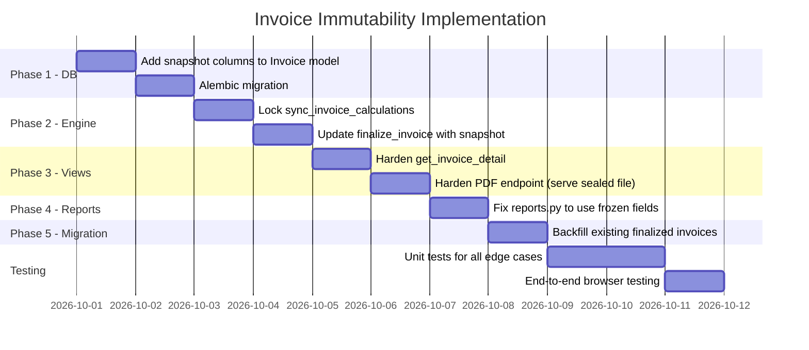

# Strategic Architectural & Accounting Plan: Absolute Immutability & Financial Consistency for Finalized Invoices

> [!IMPORTANT]
> This document serves as the **single source of truth** for the invoice immutability initiative. It combines perspectives from senior software engineering, statutory accounting (Indian GST Act), and financial control to produce a production-grade hardening plan.

---

## 1. Executive Summary & Dual Perspective

When a customer invoice is marked as **Finalized** (and ready for payment), it crosses a legal and financial boundary: it transitions from an **operational estimate** to a **statutory tax invoice and closed financial instrument**.

In business accounting, allowing subsequent changes to catalog prices, technician labor costs, or GST tax slabs to retroactively mutate finalized invoices is a **critical compliance and reconciliation violation**.

| Domain | Principle | Consequence of Retroactive Mutation |
| :--- | :--- | :--- |
| **Senior Accountant / Tax Specialist** | **Statutory Tax Invariance (CGST Act Sec 31, 34 & Rule 46)** | Once a tax invoice number is issued, output tax liability (CGST/SGST/IGST) is crystallized. Retroactive changes cause **GSTR-1 vs GSTR-3B vs Books mismatch**, leading to tax audit notices, interest penalties under Sec 50, and broken balance sheets. |
| **Senior Finance Specialist** | **General Ledger & Receivables Integrity** | An accounts receivable ledger entry (A/R) must balance to the exact paisa. If an invoice for ₹10,000 is finalized, and a catalog price drops it to ₹9,500 after the customer brings ₹10,000 cash, the ledger falsely reports an unexplained ₹500 overpayment or creates ghost debts. |
| **Senior Software Architect** | **Write-Once-Read-Many (WORM) & Event Immutability** | An invoice is a historical fact / snapshot, not a live projection of the catalog or workshop inventory. Catalogs are forward-looking templates; finalized invoices are frozen point-in-time documents. |

---

## 2. Current State Diagnostic: Where The Silent Vulnerabilities Lie

A comprehensive audit of the codebase reveals several strong foundations alongside **4 critical structural vulnerabilities** that explain why inconsistencies can occur.

### ✅ What Is Already Well-Architected

1. **Catalog Decoupling on Job Cards**: When adding a part or labor item to a Job Card, [job_cards.py](file:///c:/Users/satya/Desktop/exp/service-center/backend/app/api/v1/endpoints/job_cards.py) copies `unit_price`, `cost_price`, `hsn_code`, and `gst_rate` onto the `PartItem` and `LabourItem` tables. Modifying the catalog in `CatalogsPage` does **not** directly overwrite existing Job Card lines.

2. **Endpoint Guardrails**: [job_cards.py](file:///c:/Users/satya/Desktop/exp/service-center/backend/app/api/v1/endpoints/job_cards.py#L522) checks `if jc.invoice and jc.invoice.status == "FINALIZED"` and blocks additions, edits, and deletions of line items through the standard UI.

### ⚠️ The 4 Critical Vulnerabilities

```
[ Catalog Updates ] (Parts/Labour rates & GST %)
        │
        ├── (Does not touch JobCard lines directly)
        ▼
[ JobCard Lines: parts_items / labour_items ]
        ▲
        │ ⚠️ VULNERABILITY #1: No Invoice Line Snapshot Table!
        │ (Invoices read directly from JobCard lines)
        │
[ Invoice: Finalized ] ◄─── ⚠️ VULNERABILITY #2: sync_invoice_calculations() runs on payment!
        │
        ├── ⚠️ VULNERABILITY #3: PDF generated live from JobCard, not frozen snapshot
        │
        └── ⚠️ VULNERABILITY #4: Reports & Exports recalculate costs on the fly
```

---

#### Vulnerability 1: Absence of an Invoice Line Items Snapshot Table

- In [backend/app/models/\_\_init\_\_.py](file:///c:/Users/satya/Desktop/exp/service-center/backend/app/models/__init__.py#L193-L226), the `Invoice` table only holds summary columns (`parts_total`, `tax_total`, `grand_total`). **There is no `invoice_items` table.**
- Whenever an invoice is fetched ([invoices.py:L163-L233](file:///c:/Users/satya/Desktop/exp/service-center/backend/app/api/v1/endpoints/invoices.py#L163-L233)) or printed ([pdf_service.py:L206-L245](file:///c:/Users/satya/Desktop/exp/service-center/backend/app/services/pdf_service.py#L206-L245)), it queries the **live** `JobCard.parts_items` and `JobCard.labour_items`.
- If an admin edits a line, changes line status, or if data is migrated, the line items displayed on the bill will **disagree with the header grand total**.

> [!CAUTION]
> This is the **most dangerous vulnerability**. The invoice has no independent memory of what was billed. It entirely depends on the mutable Job Card relations.

---

#### Vulnerability 2: `sync_invoice_calculations()` Runs Inside Payment Recording

In [invoices.py](file:///c:/Users/satya/Desktop/exp/service-center/backend/app/api/v1/endpoints/invoices.py#L513) inside `record_payment`:

```python
db.add(payment)
db.flush()
sync_invoice_calculations(db, inv)  # <--- DANGER!
```

When a payment is recorded, it calls `sync_invoice_calculations`, which recomputes taxes, interstate flags, and line totals from the Job Card. On a finalized invoice, **`grand_total`, `tax_total`, and `taxable_amount` must be strictly locked**. Only `amount_paid`, `balance_due`, and `payment_status` should update.

---

#### Vulnerability 3: Dynamic On-the-Fly PDF Rendering

[invoices.py:L465](file:///c:/Users/satya/Desktop/exp/service-center/backend/app/api/v1/endpoints/invoices.py#L465) regenerates the invoice PDF from the **live** `JobCard` line items on every download request. If anything on the Job Card or customer profile was updated, the customer downloads a PDF that **differs from the physical paper copy** given to them earlier.

---

#### Vulnerability 4: Reports Recalculate Profitability Dynamically

In [reports.py:L44-L47](file:///c:/Users/satya/Desktop/exp/service-center/backend/app/api/v1/endpoints/reports.py#L44-L47), cost and profit are recalculated on the fly from `JobCard.parts_items` instead of reading the frozen financial numbers stored on the finalized invoice.

---

## 3. The 5 Core Principles of the Target Architecture

To satisfy both **Senior Full-Stack Architecture** and **Senior Financial Controller / Statutory CA Standards**, our design implements 5 non-negotiable principles:

```
┌────────────────────────────────────────────────────────────────────────┐
│                        IMMUTABILITY LIFECYCLE                          │
│                                                                        │
│   DRAFT STAGE               FINALIZATION                  POST-FINAL   │
│ ┌──────────────┐         ┌────────────────┐         ┌────────────────┐ │
│ │ Estimate /   │───────► │ 1. Freeze Data │───────► │ Read-Only      │ │
│ │ Quotation    │ Finalize│ 2. Assign INV# │ Payment │ Immutable      │ │
│ │ (Dynamic)    │         │ 3. Seal PDF    │ Ledger  │ Document       │ │
│ └──────────────┘         └────────────────┘         └────────────────┘ │
│         ▲                                                    │         │
│         │                    Legitimate Corrections          │         │
│         └────────────────────────────────────────────────────┘         │
│              Via Credit Note (CN) or Void-and-Reissue only             │
└────────────────────────────────────────────────────────────────────────┘
```

### Principle 1: Point-In-Time Freezing (The Frozen Snapshot Pattern)

- At the exact millisecond `finalize_invoice` is executed, all approved parts, labor, HSN/SAC codes, GST slabs (0%, 5%, 18%, 28%), quantities, unit rates, and technician costs are copied into a permanent, immutable **Invoice Snapshot** (`line_items_snapshot` frozen JSON).
- Future catalog price changes or job card line edits **never touch this snapshot**.

### Principle 2: Strict Payment Ledger Isolation

- The Invoice header (`grand_total`, `taxable_amount`, `cgst_amount`, `sgst_amount`, `igst_amount`) is **write-locked**.
- `record_payment` and `reverse_payment` only interact with the `payments` table. Outstanding balance is simply:

  ```
  Balance Due = inv.grand_total − Σ(payments)
  ```

- No recalculation of parts, labor, or tax totals can ever occur during payment processing.

### Principle 3: Sealed Document Storage

- The PDF generated at finalization is stored to disk / object storage as an immutable file: `documents/invoices/{YEAR}/{INV_NUMBER}.pdf`.
- Subsequent "View PDF" or "Download PDF" calls serve the **exact disk-sealed PDF artifact**, guaranteeing zero PDF drift.

### Principle 4: CA Audit-Proof Reporting

- Financial daybooks, GSTR-1 outward registers, and profit & loss statements read strictly from the invoice's **frozen financial fields**, never from dynamic relations.

### Principle 5: Statutory Correction Workflow (Indian GST Rule 53 & Section 34)

If an honest billing mistake is made:
- **Before delivery**: Admin voids the invoice with an audit reason (`status = "VOID"`), which preserves the invoice number in the tax audit trail, and issues a new corrected invoice.
- **After delivery**: Issue a formal **Credit Note** (reducing liability) or **Debit Note** (increasing liability).

---

## 4. Concrete Implementation Plan (Step-by-Step)

### Phase 1: Database & Model Hardening (Invoice Snapshot)

#### 1.1 Add Frozen Line Items to `Invoice`

Add an immutable snapshot relation or structured JSON column to the `Invoice` model in [backend/app/models/\_\_init\_\_.py](file:///c:/Users/satya/Desktop/exp/service-center/backend/app/models/__init__.py):

```python
class Invoice(Base, TimestampMixin):
    # ... existing fields ...
    
    # Immutable line-item snapshot captured at finalization time
    # Contains: [{item_type, description, part_number, hsn_sac, quantity, unit,
    #             unit_price, cost_price, gst_rate, tax_amount, total_amount}]
    line_items_snapshot = Column(Text, nullable=True)  # JSON-encoded frozen items
    
    # Audit & Security seals
    pdf_file_path = Column(String(255), nullable=True)
    is_locked = Column(Boolean, default=False, nullable=False)
```

> [!TIP]
> **Why JSON Snapshot vs New Table?**
> A JSON column on `invoices` (`line_items_snapshot`) provides 100% database immutability: it cannot be altered by foreign key cascades, orphan cleanups, or accidental line item queries. It is completely standalone and preserves the exact state forever.

#### 1.2 Alembic Migration

```python
# alembic/versions/xxxx_add_invoice_snapshot.py
def upgrade():
    op.add_column('invoices', sa.Column('line_items_snapshot', sa.Text(), nullable=True))
    op.add_column('invoices', sa.Column('pdf_file_path', sa.String(255), nullable=True))
    op.add_column('invoices', sa.Column('is_locked', sa.Boolean(), server_default='0', nullable=False))

def downgrade():
    op.drop_column('invoices', 'is_locked')
    op.drop_column('invoices', 'pdf_file_path')
    op.drop_column('invoices', 'line_items_snapshot')
```

---

### Phase 2: Decouple Calculation & Finalization Engine

#### 2.1 Update `finalize_invoice` in [invoices.py](file:///c:/Users/satya/Desktop/exp/service-center/backend/app/api/v1/endpoints/invoices.py#L383-L428)

When finalizing:
1. Extract all approved parts and labor lines.
2. Build the exact itemized snapshot with calculated GST amounts per line.
3. Serialize and save to `inv.line_items_snapshot`.
4. Set `inv.is_locked = True`.
5. Generate and seal the PDF artifact to disk and record the path.

```python
import json
from decimal import Decimal

# Snapshot construction during finalize_invoice:
snapshot_items = []
for p in jc.parts_items:
    if p.status in ("APPROVED", "USED"):
        tax = int(Decimal(str(p.total * p.gst_rate)) / Decimal("100")) if p.gst_rate > 0 else 0
        snapshot_items.append({
            "type": "PART",
            "description": p.description,
            "part_number": p.part_number,
            "hsn_sac": p.hsn_code or "8708",
            "quantity": p.quantity,
            "unit": p.unit,
            "unit_price": p.unit_price,
            "cost_price": p.cost_price,
            "gst_rate": p.gst_rate,
            "tax_amount": tax,
            "total": p.total
        })

for l in jc.labour_items:
    if l.status in ("APPROVED", "DONE"):
        tax = int(Decimal(str(l.total * l.gst_rate)) / Decimal("100")) if l.gst_rate > 0 else 0
        snapshot_items.append({
            "type": "LABOUR",
            "description": l.description,
            "part_number": None,
            "hsn_sac": l.sac_code or "998729",
            "quantity": l.quantity,
            "unit": "job",
            "unit_price": l.unit_price,
            "cost_price": l.cost_price,
            "gst_rate": l.gst_rate,
            "tax_amount": tax,
            "total": l.total
        })

inv.line_items_snapshot = json.dumps(snapshot_items)
inv.is_locked = True

# Store sealed PDF path
pdf_path = generate_invoice_pdf(inv, profile, save_to_disk=True)
inv.pdf_file_path = str(pdf_path)
```

#### 2.2 Fix `sync_invoice_calculations` to NEVER Mutate Finalized Invoices

Refactor `sync_invoice_calculations`:

```python
def sync_invoice_calculations(db: Session, invoice: Invoice):
    """
    Recalculates totals.
    CRITICAL FINANCIAL RULE: If status is FINALIZED or VOID, totals are IMMUTABLE.
    Only payment balances and payment_status may be updated.
    """
    all_payments = db.query(Payment).filter(Payment.invoice_id == invoice.id).all()
    amount_paid = max(0, sum(
        -p.amount if p.is_reversal else p.amount for p in all_payments
    ))

    if invoice.status in ("FINALIZED", "VOID"):
        # Header amounts CANNOT be touched! Only payment status updates.
        if amount_paid == 0:
            invoice.payment_status = "UNPAID"
        elif amount_paid < invoice.grand_total:
            invoice.payment_status = "PARTIALLY_PAID"
        else:
            invoice.payment_status = "PAID"
        db.flush()
        return  # <-- EXIT: No recalculation of line totals, taxes, or grand total

    # DRAFT calculation continues dynamically as before...
    jc = invoice.job_card
    # ... (existing DRAFT recalculation logic unchanged) ...
```

---

### Phase 3: Invoice Viewing & PDF Generation Hardening

#### 3.1 Hardened `get_invoice_detail` ([invoices.py](file:///c:/Users/satya/Desktop/exp/service-center/backend/app/api/v1/endpoints/invoices.py#L143-L305))

- If `inv.status == "FINALIZED"` and `inv.line_items_snapshot` exists:
  - Return the line items **directly from the frozen snapshot**.
  - Parse the JSON and split into `approved_parts` and `approved_labour` from the snapshot.
- This guarantees that even if a technician or admin re-opens the Job Card, the Invoice View in `InvoiceDetailModal` remains **100% faithful** to what was billed.

```python
if inv.status == "FINALIZED" and inv.line_items_snapshot:
    snapshot = json.loads(inv.line_items_snapshot)
    approved_parts = [item for item in snapshot if item["type"] == "PART"]
    approved_labour = [item for item in snapshot if item["type"] == "LABOUR"]
    # No need to query jc.parts_items or jc.labour_items for FINALIZED invoices!
```

#### 3.2 Hardened PDF Endpoint ([pdf_service.py](file:///c:/Users/satya/Desktop/exp/service-center/backend/app/services/pdf_service.py) & [invoices.py:L452](file:///c:/Users/satya/Desktop/exp/service-center/backend/app/api/v1/endpoints/invoices.py#L452))

- Check if disk PDF exists at `documents/invoices/{YEAR}/{invoice_number}.pdf`.
- **If it exists**, stream the static file directly (byte-for-byte identical every time).
- **If rendering on the fly** for finalized invoices (fallback), render **strictly from the frozen `line_items_snapshot`**, never the live job card tables.

```python
@router.get("/{invoice_id}/pdf")
def get_invoice_pdf_endpoint(invoice_id: int, db: Session = Depends(get_db), ...):
    inv = db.query(Invoice).filter(Invoice.id == invoice_id).first()
    if not inv:
        raise HTTPException(status_code=404, detail="Invoice not found")
    
    # Serve sealed PDF if available (immutable artifact)
    if inv.pdf_file_path and os.path.isfile(inv.pdf_file_path):
        with open(inv.pdf_file_path, "rb") as f:
            pdf_bytes = f.read()
        return Response(content=pdf_bytes, media_type="application/pdf", ...)
    
    # Fallback: generate from snapshot (never from live job card)
    ...
```

---

### Phase 4: Reporting & CA Audit Consistency

#### 4.1 Update [reports.py](file:///c:/Users/satya/Desktop/exp/service-center/backend/app/api/v1/endpoints/reports.py#L41-L50)

- In `build_invoice_export_dicts`, **remove the dynamic fallback** that sums live `parts_items` and `labour_items`.
- Use the frozen `inv.parts_total`, `inv.labour_total`, `inv.total_cost`, `inv.taxable_amount`, and `inv.gross_profit` exclusively.

```diff
- if inv.job_card:
-     parts_cost = sum(int((p.cost_price or 0) * (p.quantity or 1))
-                      for p in inv.job_card.parts_items if p.status in ["APPROVED", "USED"])
-     labour_cost = sum(int((l.cost_price or 0) * (l.quantity or 1))
-                       for l in inv.job_card.labour_items if l.status in ["APPROVED", "DONE"])
+ # Always use frozen header values — never recalculate from live relations
+ parts_cost = inv.total_cost  # Already frozen at finalization
+ labour_cost = 0  # Included in total_cost
```

---

### Phase 5: Backfill Existing Finalized Invoices (Data Migration)

A one-time migration script to retroactively create snapshots for all historically finalized invoices:

```python
# scripts/backfill_invoice_snapshots.py
def backfill():
    """
    One-time script: For every FINALIZED invoice that lacks a line_items_snapshot,
    build the snapshot from the current JobCard lines (best-effort historical freeze).
    """
    finalized = db.query(Invoice).filter(
        Invoice.status == "FINALIZED",
        Invoice.line_items_snapshot == None
    ).all()
    
    for inv in finalized:
        jc = inv.job_card
        if not jc:
            continue
        snapshot_items = []
        # ... build snapshot from current jc.parts_items / jc.labour_items ...
        inv.line_items_snapshot = json.dumps(snapshot_items)
        inv.is_locked = True
    
    db.commit()
    print(f"Backfilled {len(finalized)} invoices.")
```

> [!WARNING]
> Backfilled snapshots represent the **current state** of line items, not necessarily the exact state at the time of original finalization. For already-issued invoices, this is the best-effort approximation. Going forward, all new finalizations will capture exact point-in-time data.

---

## 5. Summary Table: Before vs After

| Workflow Event | Current Behavior (Vulnerable) | Target Behavior (Hardened & Audit-Proof) |
| :--- | :--- | :--- |
| **Catalog Price / GST Update** | Might cause discrepancy if live lines or recalculation is triggered. | **Zero effect.** Catalog updates strictly impact new items only. |
| **Customer Makes Payment** | Triggers `sync_invoice_calculations`, which recomputes line taxes and totals. | **Recalculation blocked.** Only cash ledger updates; invoice grand total is read-only. |
| **Viewing Finalized Invoice** | Dynamically queries Job Card lines; if a line changed status, numbers mismatch. | Reads from **frozen snapshot**. Always matches header and paper bill 100%. |
| **Downloading PDF** | Re-renders PDF using current database relations. | Returns the **sealed, timestamped PDF** generated at finalization. |
| **GST Tax Audit (GSTR-1)** | Risk of dynamic drift between invoice header and line items. | 100% mathematically verifiable audit trail matching the General Ledger. |
| **Voiding an Invoice** | Works correctly, but no line items are preserved for audit. | Frozen snapshot preserved; `VOID` watermark on sealed PDF. Audit trail intact. |

---

## 6. Edge Cases & Risk Scenarios to Handle

> [!IMPORTANT]
> The following edge cases represent real-world scenarios that **must** be explicitly handled in both backend code and frontend UI to prevent data corruption, user confusion, or statutory non-compliance.

### 6.1 Concurrent Finalization Race Condition

**Scenario**: Two staff members click "Finalize" on the same DRAFT invoice at the same instant.

**Risk**: Both requests pass the `if inv.status != "DRAFT"` check before either commits.

**Mitigation**:
- The existing retry loop with `IntegrityError` catch handles the invoice number uniqueness conflict.
- Add a **database-level SELECT FOR UPDATE** (row lock) on the Invoice row at the start of `finalize_invoice` to prevent concurrent finalization.

```python
inv = db.query(Invoice).filter(Invoice.id == invoice_id).with_for_update().first()
```

---

### 6.2 Payment Recorded on a VOID Invoice

**Scenario**: Admin voids invoice `INV-2026-00042`. A staff member, unaware, tries to record a ₹5,000 payment against it.

**Risk**: Payment ledger entry against a voided document creates an irreconcilable ghost receivable.

**Mitigation**: Already handled — [invoices.py:L489-L490](file:///c:/Users/satya/Desktop/exp/service-center/backend/app/api/v1/endpoints/invoices.py#L489-L490) rejects with HTTP 400. Verify this check remains in place after refactoring.

---

### 6.3 GST Rate Change Mid-Billing Cycle (Government Notification)

**Scenario**: Government notifies GST rate change from 18% to 12% on auto parts (HSN 8708), effective April 1st. A Job Card was opened March 28th with parts at 18%, but finalization happens April 2nd.

**Risk**: Which GST rate applies? The rate at the time of adding the item, or the rate at finalization?

**Mitigation**:
- The rate that applies is the rate **at the time of supply** (Section 12 of CGST Act = date of invoice issuance).
- Since the catalog was already updated to 12% but the Job Card line was copied at 18%, the **Job Card line's `gst_rate` (18%) is the one that gets frozen** into the snapshot at finalization.
- **UI Warning**: Before finalization, if any line's `gst_rate` differs from the current catalog rate, display a prominent advisory:
  > ⚠️ "Part X has GST rate 18% but the current catalog rate is 12%. Please verify the applicable rate before finalizing."

---

### 6.4 Partial Payment + Void Scenario

**Scenario**: Invoice `INV-2026-00050` for ₹15,000 is finalized. Customer pays ₹10,000 in cash (recorded). Later, the workshop discovers a billing error and needs to void the invoice.

**Risk**: ₹10,000 was already received in the cash register. Voiding the invoice without reversing the payment creates a ₹10,000 orphan in the ledger.

**Mitigation**:
- Before voiding, **force reverse all payments** or display a blocking warning:
  > ⚠️ "This invoice has ₹10,000 in recorded payments. All payments must be reversed before voiding. The cash must be physically returned or adjusted against the replacement invoice."
- Alternatively, auto-create reversal entries for all payments when voiding.

---

### 6.5 Admin Force-Edits Job Card After Finalization

**Scenario**: An admin bypasses the UI and directly edits a `PartItem` on a Job Card whose invoice is finalized (e.g., via Django shell, raw SQL, or a future admin panel).

**Risk**: The live Job Card lines now disagree with both the frozen snapshot and the sealed PDF.

**Mitigation**:
- The frozen snapshot is the **authoritative record**. All views and reports for finalized invoices read from the snapshot, not live Job Card data.
- Add a **database trigger or application-level check** that logs a warning to `audit_log` if a line item on a finalized-invoice Job Card is modified.
- Frontend: If `inv.is_locked == True`, hide all edit/delete controls on Job Card line items, including from Admin users.

---

### 6.6 Disk PDF File Deleted or Corrupted

**Scenario**: The `documents/invoices/2026/INV-2026-00042.pdf` file is accidentally deleted from the server filesystem.

**Risk**: The sealed PDF cannot be served. The system falls back to dynamic generation, which may produce a different document.

**Mitigation**:
- If the disk PDF is missing but `line_items_snapshot` exists, regenerate the PDF **strictly from the frozen snapshot** (not from live Job Card data). Log a warning to `audit_log`.
- Consider periodic backup of the `documents/invoices/` directory.
- The regenerated PDF should include a footer note: `"Re-generated from archived data on {date}. Original sealed copy unavailable."`

---

### 6.7 Customer Record Updated After Finalization

**Scenario**: Customer's name, phone, address, or GSTIN is updated in the Customers module after their invoice was finalized.

**Risk**: Reprinting or viewing the invoice shows the **new** customer details instead of what was on the original bill.

**Mitigation**:
- The sealed PDF preserves the original customer details at the time of finalization. Serving the disk PDF is sufficient.
- For the `get_invoice_detail` API response: consider also freezing customer and vehicle details into the snapshot:

```python
snapshot_metadata = {
    "customer_name": cust.name,
    "customer_phone": cust.phone,
    "customer_gstin": cust.gstin,
    "vehicle_reg": veh.registration_number,
    "vehicle_make": veh.make,
    "vehicle_model": veh.model,
    "odometer": jc.odometer
}
inv.line_items_snapshot = json.dumps({
    "items": snapshot_items,
    "metadata": snapshot_metadata
})
```

---

### 6.8 Rounding Differences Between Snapshot and Header

**Scenario**: The frozen `line_items_snapshot` contains per-line tax amounts calculated individually. The sum of per-line taxes may differ from the header's `cgst_amount + sgst_amount` by ±₹1 due to integer rounding.

**Risk**: CA auditor flags a ₹1 discrepancy between itemized tax and header tax.

**Mitigation**:
- At finalization time, calculate the authoritative totals **first**, then adjust the last line item's tax amount to absorb the rounding difference. This is standard practice in Indian e-invoicing (NIC portal does the same).
- Store a `rounding_adjustment` field in the snapshot metadata.

---

### 6.9 Internet/Power Failure During Finalization

**Scenario**: The `finalize_invoice` endpoint executes, assigns the invoice number and commits to DB, but the PDF generation or disk write fails due to a power outage.

**Risk**: Invoice is marked `FINALIZED` with no sealed PDF on disk. `pdf_file_path` is `None`.

**Mitigation**:
- Wrap PDF generation inside the same DB transaction. If PDF generation fails, roll back the entire finalization.
- Alternatively, mark finalization as a two-step process: `FINALIZING` → `FINALIZED`. A background job retries PDF generation for any invoices stuck in `FINALIZING` state.
- Add a health-check endpoint that identifies finalized invoices with missing PDFs and triggers re-generation from the frozen snapshot.

---

### 6.10 Discount Applied After Some Payments Already Recorded

**Scenario**: Invoice finalized for ₹10,000. Customer pays ₹6,000. Then the workshop owner wants to give a ₹2,000 discount (bringing the total to ₹8,000). But the invoice is already finalized.

**Risk**: Discount cannot be applied to a finalized invoice. The workshop owner may be frustrated.

**Mitigation**:
- Discounts can only be applied **before** finalization (current behavior, correct).
- Post-finalization, the correct workflow is:
  1. **Void** the current invoice (reversing the ₹6,000 payment).
  2. **Re-issue** a new invoice for ₹8,000 (₹10,000 - ₹2,000 discount).
  3. Record the ₹6,000 as a payment against the new invoice.
- Alternatively, issue a **Credit Note** for ₹2,000, which:
  - Reduces the balance due from ₹4,000 to ₹2,000.
  - Maintains the original invoice intact in the tax register.
- The frontend should show a tooltip on the disabled discount button: _"Discount cannot be changed after finalization. Use Void & Re-issue or issue a Credit Note."_

---

### 6.11 Multiple Job Cards for Same Vehicle with Overlapping Parts

**Scenario**: Vehicle AP09BK1234 has two open Job Cards. The same part ("Oil Filter") is added to both. The catalog price changes between the two finalizations.

**Risk**: No risk if the system is properly hardened — each Job Card copies the catalog price at the time the line item was added, and each invoice freezes its own snapshot independently.

**Verification**: Confirm that no "sync from catalog" button or background job exists that would retroactively update all Job Card lines matching a catalog item.

---

### 6.12 Zero-Rupee / Warranty / Goodwill Invoices

**Scenario**: A warranty repair results in a ₹0 invoice (all parts and labor are covered). The invoice is finalized with `grand_total = 0`.

**Risk**: The snapshot and payment logic must handle zero-total invoices without division-by-zero errors in margin calculations or payment status logic.

**Mitigation**:
- Already handled in `calculation_service.py` — margin calculation checks `if taxable_amount > 0`.
- Payment status for zero-total invoices should immediately be `"PAID"` (nothing to collect).
- Verify the PDF renders correctly with ₹0.00 totals.

---

## 7. Implementation Priority & Sequencing



---

## 8. Testing Checklist

| # | Test Case | Expected Result |
|---|-----------|-----------------|
| 1 | Finalize an invoice → check `line_items_snapshot` is populated | JSON contains all approved parts and labour with correct GST amounts |
| 2 | Update catalog price after finalization → view finalized invoice | Invoice shows original prices from snapshot, not updated catalog prices |
| 3 | Record payment on finalized invoice → check `grand_total` | `grand_total` unchanged; only `payment_status` updated |
| 4 | Download PDF of finalized invoice twice | Byte-identical PDF both times (served from disk) |
| 5 | Void invoice with active payments | Blocks void or auto-reverses payments first |
| 6 | Edit Job Card line after finalization (via admin) | Invoice view still shows frozen snapshot data |
| 7 | Run reports export for finalized invoices | Cost/profit read from `inv.total_cost` / `inv.gross_profit`, not dynamic calculation |
| 8 | Finalize invoice with 0% GST items | Snapshot correctly stores `gst_rate: 0` and `tax_amount: 0` |
| 9 | Concurrent finalization requests | Only one succeeds; the other gets a clear error |
| 10 | Backfill script on existing data | All historically finalized invoices get snapshots without errors |

---

> [!NOTE]
> This plan is designed to be implemented incrementally. Each phase is independently deployable and testable. The most critical fix — **locking `sync_invoice_calculations` for finalized invoices** (Phase 2.2) — should be deployed first as it addresses the highest-risk vulnerability with the smallest code change.
